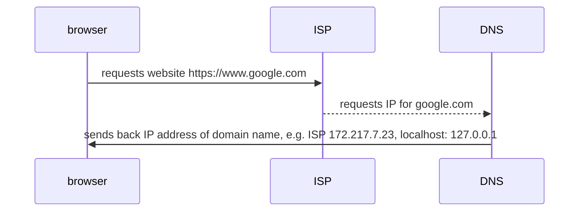

# How does the internet work

* `ISP: internet service provider`
* `DNS: domain name system`

```mermaid
sequenceDiagram
participant browser
participant ISP
participant DNS
%% end of participant declaration

%% Note over ISP: internet service provider
%% Note right of DNS: domain name system
%% end of notes

browser ->> ISP: requests website https://www.google.com
ISP -->> DNS: requests IP for google.com
DNS ->> browser: sends back IP address of domain name, e.g. ISP 172.217.7.23, localhost: 127.0.0.1
%% end of flow
```

----------------------------------------------------------------

