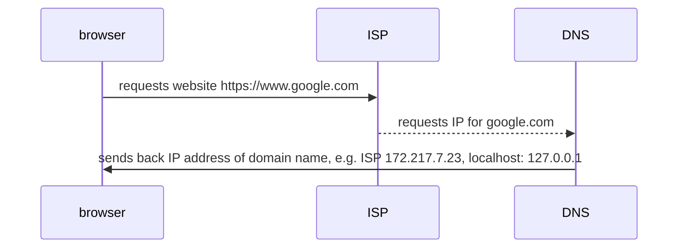
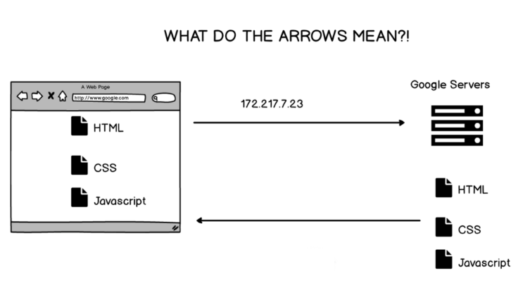
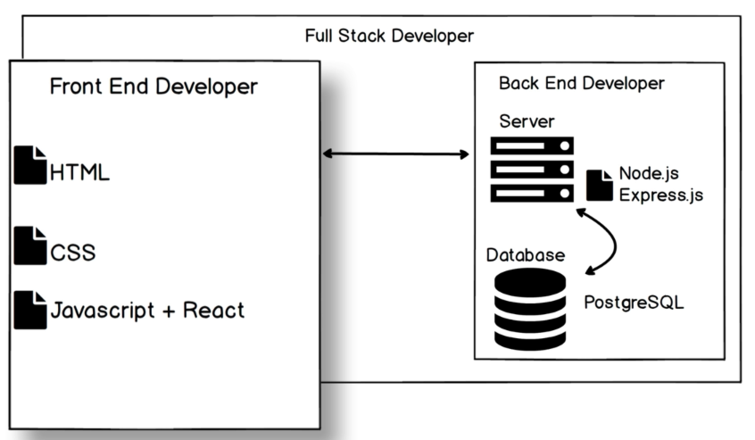

- [How does the internet work](#how-does-the-internet-work)
  - [Browser, ISP & DNS](#browser-isp--dns)
  - [Internet Backbone](#internet-backbone)
  - [Traceroute](#traceroute)
  - [How to improve performance of your website](#how-to-improve-performance-of-your-website)
  - [BE - FE](#be---fe)

# How does the internet work

## Browser, ISP & DNS

* `ISP: internet service provider`
* `DNS: domain name system`



----------------------------------------------------------------



## [Internet Backbone](https://www.submarinecablemap.com/)

## Traceroute 

```bash
#!/bin/bash
traceroute google.com
```

## How to improve performance of your website
 - location of server 
 - how many trips
 - size of files

## BE - FE
